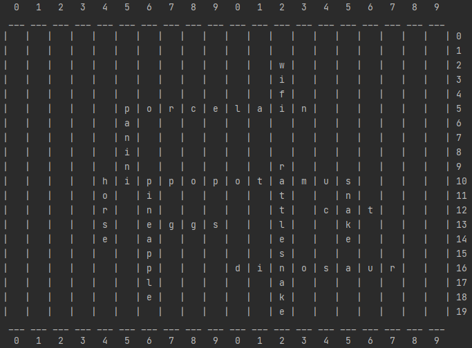

# crossword-builder
Giving a list of words the program builds a crossword board out of it
```crossword(['hippopotamus', 'horse', 'loon', 'snake', 'cat', 'rattlesnake','dinosaur', 'pineapple', 'eggs', 'panini', 'porcelain', 'wifi'])```


